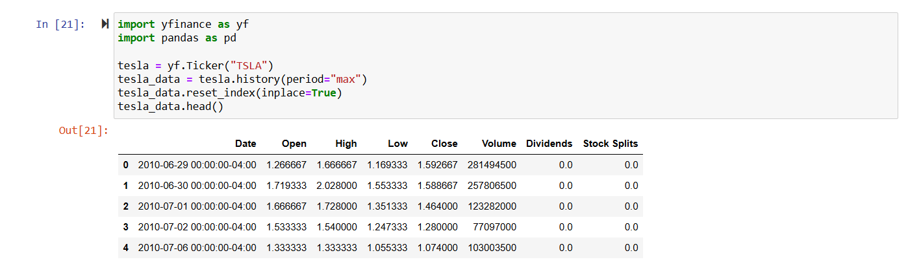
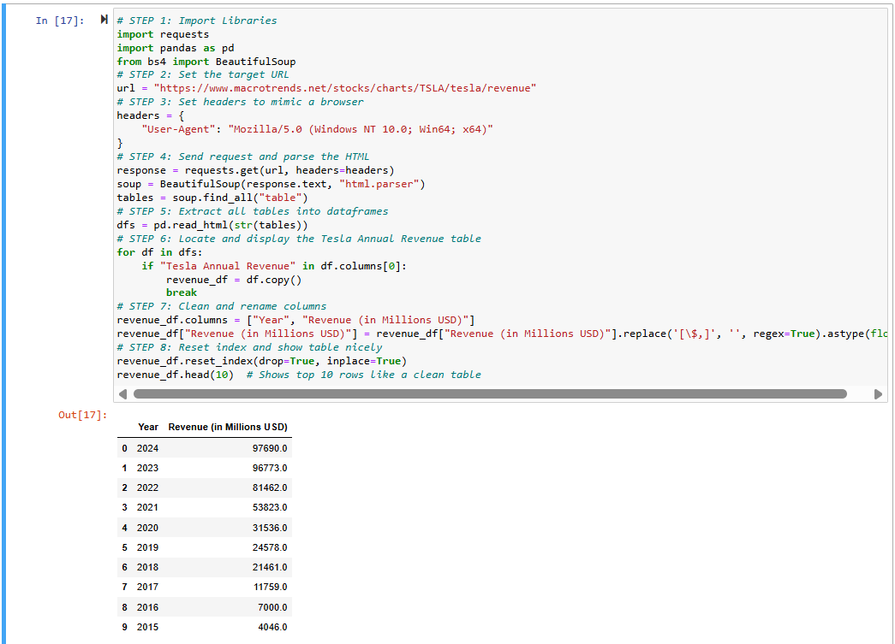
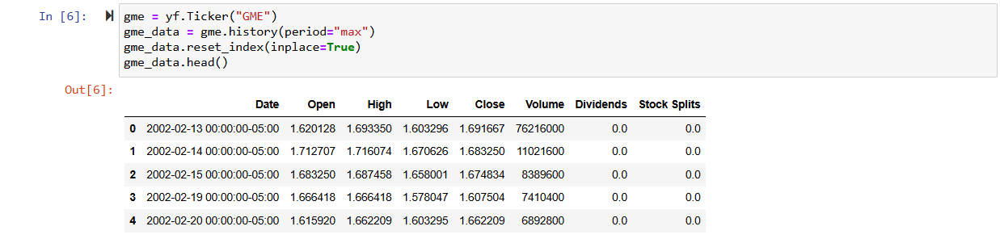
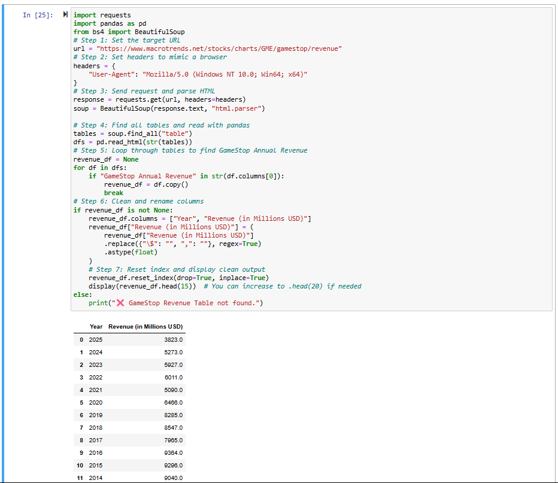
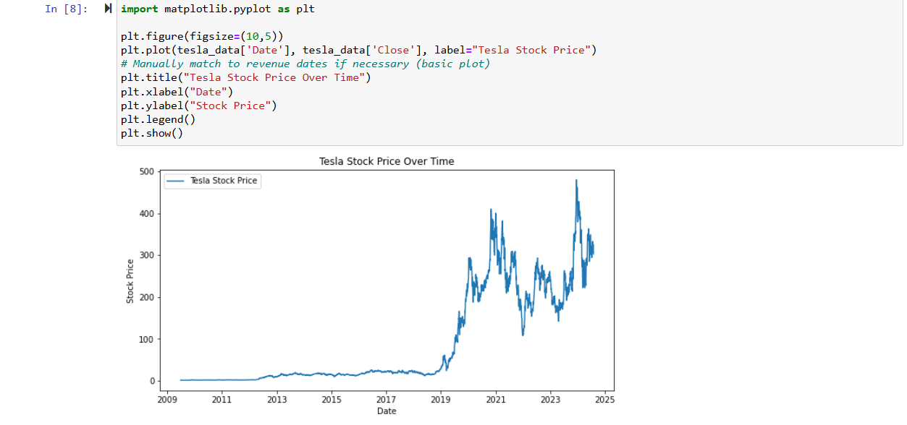
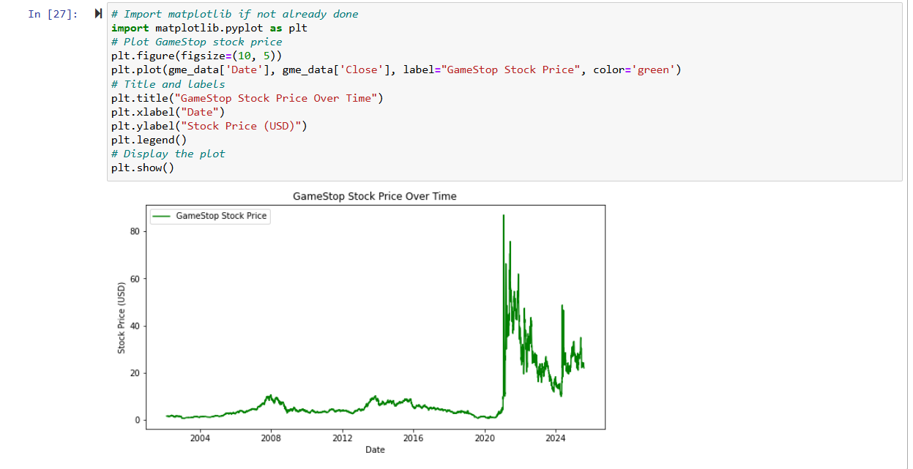

# 📘 Tesla vs GameStop: A Mini Stock Analysis

Welcome to a beginner-friendly stock analysis project built as part of the **IBM Data Science Professional Certificate** course.  
This repository compares historical stock trends and revenue data of **Tesla** and **GameStop**, using Python libraries like `yfinance`, `BeautifulSoup`, and `plotly`.

🧪 This mini project showcases key skills in data extraction, web scraping, and stock trend visualization using Jupyter Notebooks.

---

## 📂 Repository Structure

- `Stock and Revenue Analysis of Tesla & GameStop using Python.ipynb` — Main notebook file  
- `screenshot/` — Folder containing all screenshots required for submission  

---

## ✅ Features Demonstrated

- 📥 Stock price extraction using `yfinance`  
- 🌐 Revenue data scraping from external sources  
- 📈 Stock data visualization using `plotly`  
- 🧪 Clear use of `head()`, `tail()` functions, and graph plots  
- 💻 Notebook hosted and shared on GitHub for peer review  

---

## 💡 Key Learning Outcomes

- 🎯 Understand and visualize stock price trends  
- 🧑‍💻 Combine data science tools for finance-based mini projects  
- 🔄 Practice reproducibility and version control using GitHub  
- 📂 Organize assignment screenshots and notebooks effectively  

---

## 🖼️ Screenshot Overview

| Step | File Name                          | Description                                |
|------|-----------------------------------|--------------------------------------------|
| 1️⃣  | `Q1_Tesla_Stock_Data_Head.png`     | Tesla stock data using `head()`            |
| 2️⃣  | `Q2_Tesla_Revenue_Data_Tail.png`   | Tesla revenue data using `tail()`          |
| 3️⃣  | `Q3_GameStop_Stock_Data_Head.png`  | GameStop stock data using `head()`         |
| 4️⃣  | `Q4_GameStop_Revenue_Data_Tail.png`| GameStop revenue data using `tail()`       |
| 5️⃣  | `Q5_Tesla_Stock_Graph.png`         | Tesla stock data graph                     |
| 6️⃣  | `Q6_GameStop_Stock_Graph.png`      | GameStop stock data graph                  |

---

## 📸 Screenshot Walkthrough (Visual Preview)

### 🖼 1. Tesla Stock Data (Head)

### 🖼 2. Tesla Revenue Data (Tail)

### 🖼 3. GameStop Stock Data (Head)

### 🖼 4. GameStop Revenue Data (Tail)

### 🖼 5. Tesla Stock Graph

### 🖼 6. GameStop Stock Graph

---

## 👨‍💻 Author

**Abinash Prasana**  
📬 [GitHub Profile](https://github.com/abinashprasana)
